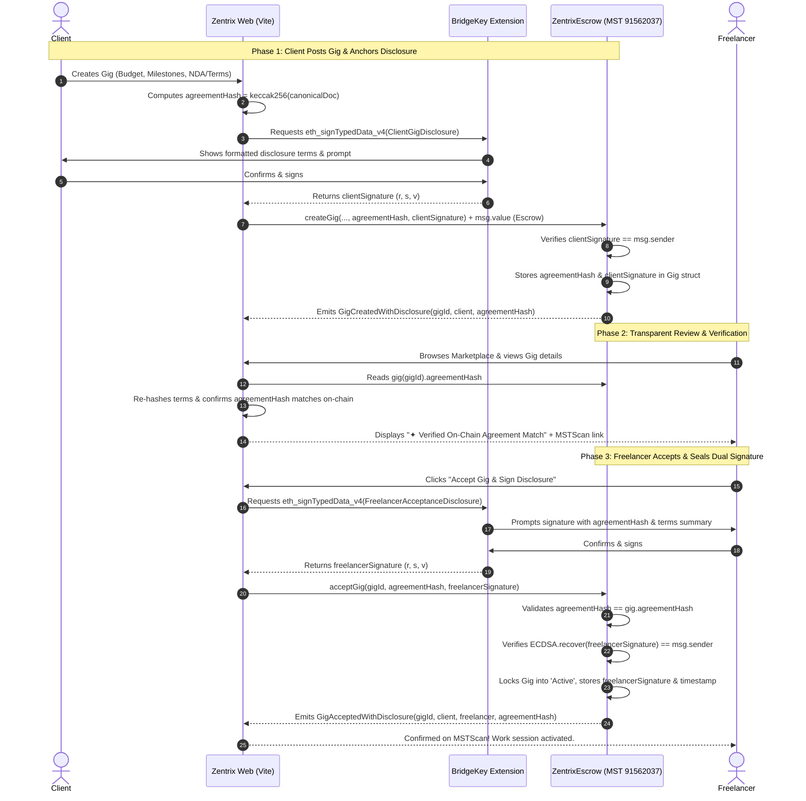

# Zentrix: On-Chain Disclosure & Digital Signature Architecture

> **Specification Version:** 1.0  
> **Network:** MST Testnet (Chain ID `91562037`)  
> **Target Contracts:** `ZentrixEscrow` (`0xa50759E9CE985Fbb06503CaeC0DB9D1fB1233726`) & `ZentrixReputation` (`0xB224Bd880326a5046F8526461d25fa5217636cA3`)  
> **Standards:** EIP-712 (Typed Structured Data), OpenZeppelin v5 `ECDSA`, Information Technology Act (India, 2000 §10A)

---

## 1. Executive Summary & Objective

In centralized freelance marketplaces (Upwork, Fiverr), service contracts and non-disclosure terms are stored in private databases. Platforms can retroactively alter terms of service, clients can dispute agreements without verifiable audit trails, and neither party possesses cryptographic proof of mutual consent.

**Zentrix On-Chain Disclosure Protocol** establishes:
1. **Immutable Disclosure Anchoring:** When a client posts a gig, the full legal and operational disclosure (milestone deliverables, auto-release conditions, IP ownership, arbitration rules) is cryptographically hashed (`bytes32 agreementHash`) and immutably sealed on the MST Blockchain alongside the deposited escrow funds.
2. **Dual-Party Non-Repudiation via EIP-712:** Both the client (during gig publication) and the freelancer (during gig acceptance) cryptographically sign the structured agreement using their BridgeKey / EVM wallet private keys.
3. **Public & Transparent Verifiability:** Anyone can audit the transaction on MSTScan explorer (`https://testnet.mstscan.com`), inspect the agreement hash, and verify the cryptographic signatures without exposing personal identifiable information (PII) on-chain (complying with Hard Rule 4 and DPDP Act 2023).

---

## 2. Cryptographic Security & Zero-PII Protocol

### 2.1 Off-Chain Document Canonicalization
The disclosure document contains:
- **Project Specifications:** Scope, acceptance criteria, milestone breakdown, and deadlines.
- **Economic Terms:** Total escrow in `tMSTC`, milestone disbursement percentages, 72h auto-release terms.
- **Legal Clauses:** IP assignment upon final payout, confidentiality/NDA covenants, decentralized arbitration clause.
- **Parties' Public Keys:** Client wallet address and Freelancer wallet address.

```
+---------------------------------------------------------+
|                  Canonical Agreement JSON               |
|  - gigTitle, scopeSummary, milestones[], arbitration    |
|  - clientAddress, ipOwnershipClause, autoReleaseHours   |
+---------------------------------------------------------+
                            │
                            ▼  Keccak-256 Hashing
                  +-------------------+
                  |   agreementHash   |  (bytes32 digest)
                  +-------------------+
```

> [!IMPORTANT]
> **Hard Rule 4 Adherence:** Names, physical addresses, emails, and phone numbers are **NEVER** embedded into the canonical disclosure document or hashed into the on-chain payload. Only Ethereum addresses, hashed deliverables, and CIDs touch the MST Blockchain.

---

## 3. EIP-712 Typed Structured Data Signing

Rather than relying on opaque binary blobs (`eth_sign`), Zentrix implements **EIP-712** typed structured data signing. When BridgeKey prompts the user, the wallet displays readable fields ensuring users understand what they are signing.

### 3.1 Domain Separator
```solidity
bytes32 public constant DOMAIN_TYPEHASH = keccak256(
    "EIP712Domain(string name,string version,uint256 chainId,address verifyingContract)"
);

bytes32 public immutable domainSeparator = keccak256(
    abi.encode(
        DOMAIN_TYPEHASH,
        keccak256(bytes("Zentrix Disclosure Protocol")),
        keccak256(bytes("1")),
        91562037, // MST Testnet Chain ID
        address(this)
    )
);
```

### 3.2 Struct Types & Signatures

#### A. Client Gig Publication Disclosure (`ClientGigDisclosure`)
```solidity
bytes32 public constant CLIENT_DISCLOSURE_TYPEHASH = keccak256(
    "ClientGigDisclosure(uint256 gigId,bytes32 agreementHash,uint256 totalBudget,uint256 milestoneCount,uint256 timestamp)"
);
```

#### B. Freelancer Gig Acceptance Disclosure (`FreelancerAcceptanceDisclosure`)
```solidity
bytes32 public constant FREELANCER_DISCLOSURE_TYPEHASH = keccak256(
    "FreelancerAcceptanceDisclosure(uint256 gigId,bytes32 agreementHash,address freelancer,uint256 timestamp)"
);
```

---

## 4. End-to-End Workflow & Lifecycle



---

## 5. Smart Contract Data Structures & Interface

### 5.1 On-Chain Storage Struct
```solidity
struct DisclosureAgreement {
    bytes32 agreementHash;       // SHA256/Keccak256 digest of canonical terms
    bytes clientSignature;       // EIP-712 signature from Client
    bytes freelancerSignature;   // EIP-712 signature from Freelancer
    uint256 clientSignedAt;      // Block timestamp of creation
    uint256 freelancerSignedAt;  // Block timestamp of acceptance
    bool isDualSigned;           // True once both parties have sealed agreement
}

struct Gig {
    uint256 id;
    address client;
    address freelancer;
    uint256 totalAmount;
    uint8 status;                // 0: Created, 1: Active, 2: Completed, 3: Disputed
    DisclosureAgreement disclosure;
    // ... milestones[]
}
```

### 5.2 Solidity Verification Methods
```solidity
function createGigWithDisclosure(
    uint256[] calldata plan,
    uint256 reviewWindow,
    bytes32 agreementHash,
    bytes calldata clientSignature
) external payable returns (uint256 gigId) {
    require(agreementHash != bytes32(0), "Empty agreement hash");
    
    // Verify client's signature over the agreement hash
    bytes32 digest = _hashTypedDataV4(keccak256(abi.encode(
        CLIENT_DISCLOSURE_TYPEHASH,
        nextGigId,
        agreementHash,
        msg.value,
        plan.length,
        block.timestamp
    )));
    address recoveredClient = ECDSA.recover(digest, clientSignature);
    if (recoveredClient != msg.sender) revert InvalidClientSignature();

    // Standard escrow deposit logic...
}

function acceptGigWithDisclosure(
    uint256 gigId,
    bytes32 agreementHash,
    bytes calldata freelancerSignature
) external {
    Gig storage gig = gigs[gigId];
    if (gig.disclosure.agreementHash != agreementHash) revert AgreementMismatch();

    // Verify freelancer's signature over the agreement hash
    bytes32 digest = _hashTypedDataV4(keccak256(abi.encode(
        FREELANCER_DISCLOSURE_TYPEHASH,
        gigId,
        agreementHash,
        msg.sender,
        block.timestamp
    )));
    address recoveredFreelancer = ECDSA.recover(digest, freelancerSignature);
    if (recoveredFreelancer != msg.sender) revert InvalidFreelancerSignature();

    gig.freelancer = msg.sender;
    gig.disclosure.freelancerSignature = freelancerSignature;
    gig.disclosure.freelancerSignedAt = block.timestamp;
    gig.disclosure.isDualSigned = true;
    gig.status = 1; // Active

    emit GigAcceptedWithDisclosure(gigId, gig.client, msg.sender, agreementHash, block.timestamp);
}
```

---

## 6. Frontend UI / UX Implementation Plan

### 6.1 Client "Post Gig" Step
1. **Disclosure Review Modal:**
   - Client configures: IP Ownership (Work-for-Hire), NDA (Strict vs Standard), 72h auto-release acknowledgement.
   - Live document preview generates an interactive PDF/JSON card.
2. **One-Click BridgeKey Digital Sign:**
   - Button: `Sign Disclosure & Post to MST Chain`.
   - Pending state shows: `Awaiting BridgeKey Signature...` $\rightarrow$ `Broadcasting Escrow to Chain 91562037...` $\rightarrow$ `Confirmed on MSTScan`.

### 6.2 Freelancer "Accept Gig" Step
1. **Pre-Acceptance Disclosure Modal:**
   - Freelancer views the exact `agreementHash` and compares with the canonical terms.
   - Badge states: `✦ Cryptographically Verified Against MST Testnet Escrow`.
2. **Signature Execution:**
   - Button: `Digitally Sign & Lock Agreement`.
   - Executes `eth_signTypedData_v4` followed by on-chain `acceptGigWithDisclosure`.
   - Success state displays transaction hash and dual-signed certificate preview.

### 6.3 Public Disclosure Audit Page (`/disclosure`)
- Displays live query tool: Enter `Gig ID` or `Contract Address`.
- Shows:
  - Client Address & Signature Timestamp.
  - Freelancer Address & Signature Timestamp.
  - On-chain `agreementHash` with direct copy button.
  - Explorer links to MSTScan tx hashes.

---

## 7. Legal Admissibility & Jurisdiction

Under **Section 10A of the Information Technology Act, 2000 (India)**:
> *"Where in a contract formation, the communication of proposals, the acceptance of proposals, the revocation of proposals and acceptances, as the case may be, are expressed in electronic form or by means of an electronic record, such contract shall not be deemed to be unenforceable solely on the ground that such electronic form or means was used for that purpose."*

By pairing asymmetric cryptographic signatures (EIP-712 via secp256k1) with immutable timestamping on the MST Blockchain:
- **Integrity is Guaranteed:** Any alteration to the text produces a different hash.
- **Non-Repudiation is Absolute:** Only the holder of the respective private key could have emitted the signature.
- **Zero Platform Rake or Censorship:** The contract state is publicly verifiable on testnet explorer 24/7.
