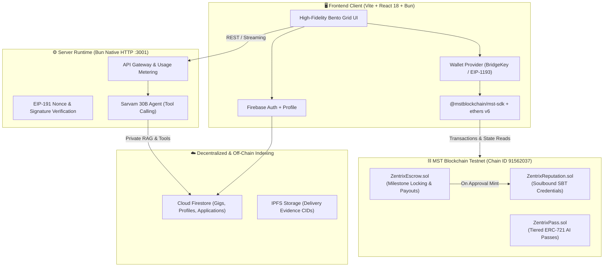

# Zentrix ⚡

**Autonomous Milestone Escrow & AI Talent Matchmaking on MST Blockchain**  
*MST Blockchain × NEWRRO Buildathon 2026 · BMS College of Engineering, Bengaluru*

[](https://testnet.mstscan.com)
[](https://www.sarvam.ai)
[](https://bun.sh)
[](https://vitejs.dev)
[](./LICENSE)

> *"Don't just build on blockchain — build something that becomes strictly better because of blockchain."*

---

## 📖 Table of Contents

- [Overview](#-overview)
- [System Architecture](#-system-architecture)
- [Key Features](#-key-features)
- [Verified Testnet Deployments](#-verified-testnet-deployments)
- [User Experience & Bento UI](#-user-experience--bento-ui)
- [Smart Contract Deep Dive](#-smart-contract-deep-dive)
- [Sarvam AI Integration](#-sarvam-ai-integration)
- [Navigation & Wireframe Specification](#-navigation--wireframe-specification)
- [Getting Started & Local Development](#-getting-started--local-development)
- [Verification & Gate Enforcement](#-verification--gate-enforcement)
- [Security & Compliance](#-security--compliance)
- [License](#-license)

---

## 🌟 Overview

Zentrix is a decentralized, freelance marketplace built to solve the universal freelance trust dilemma. On Web2 platforms (like Upwork or Fiverr), payments and accounts are subjected to arbitrary holds, high 10–20% rake fees, and opaque dispute processes. 

Zentrix anchors **money, milestones, agreements, and professional reputation directly on the MST Blockchain**, combined with **Sarvam AI (30B)** for privacy-preserving talent discovery.

### The Zentrix Advantage
1. **Zero Platform Commission (0%):** Value flows directly between client and freelancer without middleman extraction.
2. **Autonomous Milestone Escrow:** Client funds 100% upfront in `tMSTC`. Funds are locked non-custodially in smart contracts.
3. **72-Hour Auto-Release Guarantee:** Eliminates client ghosting. If a client goes unresponsive after milestone delivery, the smart contract unlocks funds automatically to the freelancer.
4. **Soulbound Credentials (ERC-721):** Completing milestones mints permanent, non-transferable on-chain credentials. Reputation cannot be purchased, transferred, or deleted by a centralized company.
5. **Private AI Matchmaking:** Server-side Sarvam 30B LLM matches requirements with verified talent while guaranteeing zero Personally Identifiable Information (PII) leakage.

---

## 🏗️ System Architecture



---

## 🛡️ Key Features

### 1. Trust-Minimized Milestone Escrow (`ZentrixEscrow.sol`)
- **Upfront Full Funding:** Clients deposit the entire project budget in `tMSTC` upon contract creation.
- **Pull Payments:** Freelancers withdraw approved funds on their own terms via the Checks-Effects-Interactions pattern, preventing reentrancy and DOS attacks.
- **Negotiated Deadlines:** Freelancer and client can mutually propose and accept deadline extensions on-chain.
- **Fair Arbiter Dispute Path:** If a milestone submission is rejected and disputed, an designated arbiter can fairly split or allocate remaining milestone funds.

### 2. Soulbound Reputation Credentials (`ZentrixReputation.sol`)
- Non-transferable ERC-721 tokens minted upon milestone completion.
- Reverts any `transferFrom` or `safeTransferFrom` invocation.
- Provides cryptographic proof of past work, job ratings, and verifiable competencies on MSTScan.

### 3. ZentrixPass NFT Access (`ZentrixPass.sol`)
- Tiered subscription passes stored on-chain:
  - **Free Tier:** 2 AI queries / day (Available to all connected wallets).
  - **Scout Pass (Tier 1):** 5 AI queries / day, Scout badge, priority AI match scoring.
  - **Builder Pass (Tier 2):** 15 AI queries / day, Builder profile badge, priority dispute queue.
  - **Architect Pass (Tier 3):** Unlimited AI queries / day, Enterprise badge, maximum throughput.
- Enforced on-chain with 30-day auto-expiry (`PASS_DURATION = 30 days`).

### 4. Sarvam 30B Talent Matchmaking
- Server-side tool calling powered by Sarvam's `sarvam-30b` model.
- Analyzes project budgets, milestone deliverables, and candidate portfolios.
- **DPDP Act 2023 Compliance:** Phone numbers, personal email addresses, and private identities are automatically redacted prior to processing.

---

## 🔗 Verified Testnet Deployments

All Zentrix contracts are deployed, active, and verified on **MST Blockchain Testnet**:

| Contract Name | Address | Explorer Link |
|---|---|---|
| **`ZentrixEscrow`** | `0xa50759E9CE985Fbb06503CaeC0DB9D1fB1233726` | [View on MSTScan](https://testnet.mstscan.com/address/0xa50759E9CE985Fbb06503CaeC0DB9D1fB1233726) |
| **`ZentrixReputation`** | `0xB224Bd880326a5046F8526461d25fa5217636cA3` | [View on MSTScan](https://testnet.mstscan.com/address/0xB224Bd880326a5046F8526461d25fa5217636cA3) |
| **`ZentrixPass`** | `0xE33932ba495ff04b321a2c7E58C34b43A7Ff2e9b` | [View on MSTScan](https://testnet.mstscan.com/address/0xE33932ba495ff04b321a2c7E58C34b43A7Ff2e9b) |

### On-Chain Proof Transactions

| Action | Transaction Hash | Status | Explorer Link |
|---|---|---|---|
| **Deploy Contracts** | `0x03f4a7c32f86c9eb639ad210070c1555bf88133b7ab4957160531828956650e0` | Confirmed | [MSTScan Tx](https://testnet.mstscan.com/tx/0x03f4a7c32f86c9eb639ad210070c1555bf88133b7ab4957160531828956650e0) |
| **Fund Demo Client** | `0x03f4a7c32f86c9eb639ad210070c1555bf88133b7ab4957160531828956650e0` | Confirmed | [MSTScan Tx](https://testnet.mstscan.com/tx/0x03f4a7c32f86c9eb639ad210070c1555bf88133b7ab4957160531828956650e0) |
| **Fund Demo Freelancer**| `0x24feec36f0bf14315aad3a89ab43b101f741d3789d9c7b62c135c4217d484014` | Confirmed | [MSTScan Tx](https://testnet.mstscan.com/tx/0x24feec36f0bf14315aad3a89ab43b101f741d3789d9c7b62c135c4217d484014) |

---

## 🎨 User Experience & Bento UI

The application avoids standard generic boilerplate templates and instead implements custom, high-fidelity UI elements:

- **2.5s Branded Splash Screen:** Displays an animated Zentrix mark, progress bar, real-time connectivity feedback, and MST chain validation before seamless page reveal.
- **Asymmetric Bento Grid Design:** Card layouts feature high-radius geometric boundaries (`rounded-3xl` / `24px+`), bold dark/cream contrast, and clean typographic hierarchy.
- **Strict Theme Token Enforcement:** Powered by `src/styles/tokens.css`. Zero raw hex values in components:
  - Primary Red: `#D84040` (`--zx-primary`)
  - Deep Red: `#A31D1D` (`--zx-primary-deep`)
  - Warm Cream: `#ECDCBF` (`--zx-cream`)
  - Dark Ink: `#2A0F0F` (`--zx-ink`)
  - Soft Surface: `#F7EFDF` (`--zx-surface`)
- **Live On-Chain Data:** Dashboard, Pricing, and Marketplace query live contract methods (`withdrawable()`, `tierPrices()`, `tierOf()`, `balanceOf()`) rather than rendering placeholder mocks.

---

## 🧩 Smart Contract Deep Dive

Contracts are located in `/contracts` and written in Solidity `^0.8.20` using OpenZeppelin v5:

```
contracts/
├── contracts/
│   ├── ZentrixEscrow.sol        # Multi-milestone escrow with auto-release
│   ├── ZentrixReputation.sol    # Soulbound ERC-721 credential tokens
│   └── ZentrixPass.sol          # Subscription passes with 30-day duration
├── test/
│   ├── ZentrixEscrow.test.ts    # Comprehensive test suite (15 passing tests)
│   └── test-helpers.ts          # Mock timestamps and ethers helpers
└── hardhat.config.ts            # Network config for MST Testnet (Chain 91562037)
```

### Test Suite Results
```bash
bun x hardhat test
```
```
  ZentrixEscrow & ZentrixReputation
    Gig Creation & Funding
      ✔ should allow a client to create a gig with a valid plan
      ✔ should revert funding if msg.value does not equal sum(plan)
    Lifecycle: Acceptance, Submission, Approval, Withdrawal
      ✔ should complete golden path: accept -> submit -> approve -> withdraw
      ✔ should allow client to cancel unaccepted gig after 48 hours
    Dispute Resolution & Auto-Release
      ✔ should auto-release milestone funds after reviewWindow expires
      ✔ should handle reject -> dispute -> arbiter split correctly
    Deadline Negotiation
      ✔ should require proposal and mutual acceptance for deadline extension
    Soulbound Tokens: Transfer Reversion
      ✔ should revert any transfer of Reputation NFT between users

  ZentrixPass
    ✔ should have correct initial tier prices
    ✔ should allow purchasing Pro Pass (Tier 1) and report tier 1
    ✔ should refund excess payment when buying a pass
    ✔ should expire after 30 days and return tier 0
    ✔ should revert transfer between accounts (soulbound)
    ✔ should allow admin to update tier price
    ✔ should allow admin to withdraw accumulated fees

  15 passing (986ms)
```

---

## 🤖 Sarvam AI Integration

Sarvam AI (`sarvam-30b`) powers the intelligent matchmaking features:
- **Server-Side Exclusivity:** The browser never directly contacts the AI provider or exposes keys.
- **Tool Calling:** The model invokes specialized tools (`search_gigs`, `search_freelancers`) through the Bun server.
- **Quota & Tier Metering:** Each query consumes daily credits associated with the wallet's `ZentrixPass` tier. Daily quotas reset at **IST midnight (18:30 UTC)**.

---

## 🧭 Navigation & Wireframe Specification

- **Logo:** Direct link to Home.
- **Home (`/`):** Hero headline, animated live metrics, core pillars, and golden path walkthrough.
- **About (`/about`):** Technical architecture bento grid, live network parameters, contract cards with copyable addresses.
- **Products:**
  - **Marketplace (`/marketplace`):** Filter by tags (Web3, AI, Smart Contracts), search gigs, post custom milestone gig, apply with proposal.
  - **AI Agents (`/agent`):** Chat bubble interface with suggestions, loading dots, and server-side Sarvam 30B streaming.
- **Monitor:**
  - **Pricing (`/pricing`):** ZentrixPass tiers, live `tierPrices()` on-chain prices, and instant minting.
  - **Dashboard (`/dashboard`):** Real-time `withdrawable()` balance, pull withdrawal button, milestone breakdown, and soulbound credentials.
- **Login / Onboarding:**
  - Firebase Authentication (Google / Email).
  - Role selection (Client or Freelancer).
  - Mandatory BridgeKey wallet binding via EIP-191 personal sign.

---

## 🚀 Getting Started & Local Development

### Prerequisites
- **Bun** (v1.3.14 or newer) installed. [Get Bun](https://bun.sh)
- **BridgeKey Extension** (Chrome Web Store) or compatible EVM wallet.
- **MST Testnet RPC:** `https://testnetrpc.mstblockchain.com`
- **Chain ID:** `91562037`
- **MST Testnet Faucet:** [https://faucet.masterstroke.academy](https://faucet.masterstroke.academy)

### 1. Clone & Install
```bash
git clone https://github.com/Precise-Goals/Zentrix.git
cd Zentrix

# Install dependencies using Bun
bun install
```

### 2. Environment Setup
Copy the sample environment file and provide your credentials in `.env.local`:
```bash
cp .env.example .env.local
```
Key variables:
```ini
# MST Testnet
MST_TESTNET_RPC=https://testnetrpc.mstblockchain.com
CHAIN_ID=91562037

# Deployer / Keys
DEPLOYER_PRIVATE_KEY=your_private_key_here
DEMO_CLIENT_ADDRESS=0x7FC1d02922d4865fd53De59697407a42e64d1Cad
DEMO_FREELANCER_ADDRESS=0x8cA0f3176997F32CCBb4598Fc8C966C95aeEEc9e

# Sarvam AI
SARVAM_API_KEY=your_sarvam_api_key_here

# Firebase
VITE_FIREBASE_API_KEY=your_firebase_api_key
VITE_FIREBASE_PROJECT_ID=growup-dec3f
```

### 3. Launch Development Server (Parallel Frontend + Backend)
```bash
bun run dev
```
This concurrently starts:
- **Vite React Frontend:** [`http://localhost:3000`](http://localhost:3000)
- **Bun Backend Server:** [`http://localhost:3001`](http://localhost:3001)

### 4. Build for Production
```bash
bun run build
```

---

## 🔒 Verification & Gate Enforcement

The repository includes an automated verification gate script (`scripts/gate.sh`) that validates contract safety, secret hygiene, token styling, and live testnet proof:

```bash
# Run all 6 gates
bash scripts/gate.sh all
```

Individual gate checks:
- `bash scripts/gate.sh env` — Validates RPC connectivity and testnet balance requirements.
- `bash scripts/gate.sh contracts` — Compiles contracts, runs Solhint, and executes 15 Hardhat tests.
- `bash scripts/gate.sh web` — Executes TypeScript typecheck and production Vite build.
- `bash scripts/gate.sh secrets` — Scans for leaked private keys, API tokens, and credentials.
- `bash scripts/gate.sh theme` — Verifies zero raw hex color strings exist outside `tokens.css`.
- `bash scripts/gate.sh proof` — Confirms deployed contracts and proof transactions on MSTScan.

---

## 🛡️ Security & Compliance

- **No Secrets in Code:** Secrets are strictly prohibited from commits and logs.
- **Testnet-Only Scope:** Hard-gated to Chain ID `91562037`. Mainnet transactions and private networks are rejected.
- **Reentrancy Protection:** All value-transferring methods in `ZentrixEscrow` utilize OpenZeppelin `ReentrancyGuard` and pull-payment withdrawal patterns.
- **Arbiter Transparency:** For hackathon evaluation, the deployer wallet acts as the dispute arbiter. Mainnet roadmap targets decentralized Kleros/Aragon-style community juries.

---

## 📄 License

This project is open-source and licensed under the **MIT License**. See the [LICENSE](./LICENSE) file for complete terms.

```
MIT License
Copyright (c) 2026 Zentrix Contributors
```
